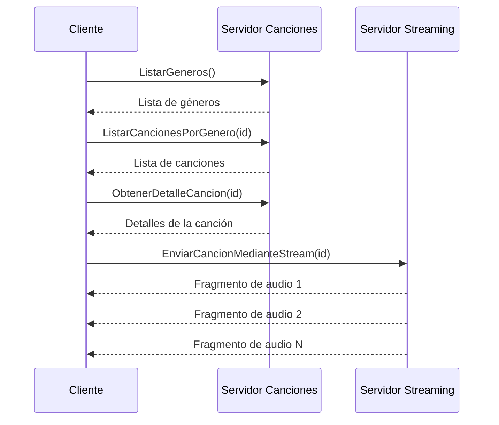

# Sistema Distribuído de Streaming de Música con gRPC

## 📋 Descripción General

Este proyecto implementa un sistema distribuido de streaming de música utilizando **gRPC** (Google Remote Procedure Call) y **Go**. El sistema está compuesto por tres componentes principales que se comunican entre sí para proporcionar servicios de consulta de canciones y streaming de audio en tiempo real.

## 🏗️ Arquitectura del Sistema

### Componentes Principales

```
┌──────────────┐    gRPC     ┌─────────────────────┐
│   Cliente    │ ──────────► │ Servidor Canciones │
│   (Puerto N) │             │   (Puerto 50051)    │
└──────────────┘             └─────────────────────┘
       │                              │
       │ gRPC                         │ Lógica de
       │ Streaming                    │ Negocio
       ▼                              ▼
┌──────────────┐             ┌─────────────────────┐
│   Servidor   │             │   Base de Datos     │
│  Streaming   │             │   (En Memoria)      │
│(Puerto 50052)│             │                     │
└──────────────┘             └─────────────────────┘
```

### 1. **Cliente** (`/cliente/`)
- **Función**: Interfaz de usuario que consume los servicios gRPC
- **Puerto**: Variable (se conecta a los servidores)
- **Responsabilidades**:
  - Proporcionar interfaz de menú interactiva
  - Realizar llamadas gRPC a ambos servidores
  - Manejar streaming de audio para reproducción

### 2. **Servidor de Canciones** (`/servidorCanciones/`)
- **Función**: Gestión de información de canciones y géneros
- **Puerto**: 50051
- **Responsabilidades**:
  - Gestionar catálogo de canciones y géneros
  - Proporcionar servicios de búsqueda y consulta
  - Mantener información metadata de las canciones

### 3. **Servidor de Streaming** (`/servidorStreaming/`)
- **Función**: Streaming de archivos de audio
- **Puerto**: 50052
- **Responsabilidades**:
  - Transmitir archivos de audio en fragmentos
  - Gestionar streaming en tiempo real
  - Optimizar la entrega de contenido multimedia

## 🔄 Flujo de Funcionamiento

### Flujo Principal del Sistema

1. **Inicialización**:
   ```
   Cliente → Conexión gRPC → Servidor Canciones (50051)
   Cliente → Conexión gRPC → Servidor Streaming (50052)
   ```

2. **Consulta de Géneros**:
   ```
   Cliente → ListarGeneros() → Servidor Canciones → Respuesta con géneros disponibles
   ```

3. **Consulta de Canciones por Género**:
   ```
   Cliente → ListarCancionesPorGenero(idGenero) → Servidor Canciones → Lista de canciones
   ```

4. **Streaming de Audio**:
   ```
   Cliente → EnviarCancionMedianteStream(idCancion) → Servidor Streaming → Stream de fragmentos
   ```

### Diagrama de Secuencia Detallado



## 📁 Estructura Detallada de Archivos

### `/cliente/`

#### **main/cliente.go** - Punto de Entrada del Cliente
```go
// Funciones principales:
// - Establecer conexiones gRPC a ambos servidores
// - Crear clientes gRPC para ambos servicios
// - Inicializar el menú principal
```

**Características importantes de gRPC**:
- Utiliza `grpc.Dial()` para establecer conexiones
- Crea clientes específicos para cada servicio: `ServiciosCancionesClient` y `AudioServiceClient`
- Maneja credenciales inseguras para desarrollo local

#### **vistas/menu.go** - Interfaz de Usuario
```go
// Funciones principales:
// - MostrarMenuPrincipal(): Gestiona el flujo principal de la aplicación
// - explorarGeneros(): Hace llamadas gRPC para obtener géneros
// - reproducirCancion(): Maneja el streaming de audio via gRPC
```

**Implementación de gRPC**:
- Realiza llamadas síncronas: `clienteCanciones.ListarGeneros(ctx, &pbSong.Vacio{})`
- Maneja streaming: `clienteStreaming.EnviarCancionMedianteStream(ctx, peticion)`
- Procesa respuestas con tipos generados automáticamente por protobuf

#### **utilidades/utilidades.go** - Funciones de Soporte
- Manejo de reproducción de audio usando la librería `beep`
- Procesamiento de fragmentos de audio recibidos via streaming gRPC

### `/servidorCanciones/`

#### **serviciosCancion.proto** - Definición del Contrato gRPC
```protobuf
service serviciosCanciones {
  rpc BuscarCancion(PeticionCancionDTO) returns (RespuestaCancionDTO) {}
  rpc ObtenerDetalleCancion(IdCancion) returns (DetalleCancion) {}
  rpc ListarGeneros(Vacio) returns (ListaGeneros) {}
  rpc ListarCancionesPorGenero(IdGenero) returns (ListaCanciones) {}
  rpc BuscarGenero(PeticionGeneroID) returns (RespuestaGeneroDTO) {}
}
```

**Propósito**: Define la interfaz de servicios disponibles, tipos de mensajes y estructura de datos que se intercambian entre cliente y servidor.

#### **serviciosCancion/serviciosCancion.pb.go** y **serviciosCancion_grpc.pb.go**
- **Archivos generados automáticamente** por el compilador de Protocol Buffers
- Contienen las estructuras de datos y stubs de cliente/servidor
- **NO se deben editar manualmente**

#### **vistas/servidor.go** - Servidor Principal
```go
// Funciones principales:
// - Inicializar servidor gRPC en puerto 50051
// - Registrar el servicio de canciones en el servidor
// - Comenzar a escuchar peticiones gRPC
```

**Implementación de gRPC**:
- Usa `grpc.NewServer()` para crear el servidor
- Registra el servicio con `pb.RegisterServiciosCancionesServer()`
- Implementa el patrón de controlador para manejar las peticiones

#### **dominio/cancion/controladores/controladorCanciones.go** - Controlador gRPC
```go
type ControladorCanciones struct {
    pb.UnimplementedServiciosCancionesServer
}

func (c *ControladorCanciones) BuscarCancion(ctx context.Context, req *pb.PeticionCancionDTO) (*pb.RespuestaCancionDTO, error) {
    // Implementación del método gRPC
}
```

**Características gRPC**:
- Implementa la interfaz generada automáticamente
- Cada método recibe un `context.Context` para manejo de timeouts y cancelaciones
- Retorna tipos específicos definidos en el archivo `.proto`

#### **dominio/cancion/fachadaCancionesServices/cancionesServices.go** - Lógica de Negocio
- Implementa la lógica de negocio para gestión de canciones
- Actúa como intermediario entre controladores y repositorio
- Transforma datos entre modelos internos y tipos gRPC

#### **dominio/cancion/repositorio/cancionRepositorio.go** - Acceso a Datos
- Simula una base de datos en memoria
- Carga datos iniciales de canciones y géneros
- Proporciona métodos de consulta y búsqueda

#### **dominio/cancion/modelo/cancion.go** - Modelo de Datos
```go
type Cancion struct {
    Id              int
    Titulo          string
    Artista         string
    AnioLanzamiento int
    Duracion        string
    Genero          Genero
}
```

#### **dominio/cancion/dto/respuestaCancionDTO.go** - Objetos de Transferencia
- Define estructuras para transferencia de datos
- Incluye funciones de mapeo entre modelos internos y tipos gRPC

### `/servidorStreaming/`

#### **servicios.proto** - Contrato de Streaming
```protobuf
service AudioService {
  rpc enviarCancionMedianteStream(peticionDTO) returns (stream fragmentoCancion);
}

message fragmentoCancion {
  bytes data = 1; // Fragmento de audio
}
```

**Características específicas de gRPC Streaming**:
- Utiliza la palabra clave `stream` para indicar streaming del servidor al cliente
- Define mensajes optimizados para transferencia de datos binarios

#### **serviciosStreaming/servicios.pb.go** y **servicios_grpc.pb.go**
- Archivos generados que incluyen soporte para streaming gRPC
- Contienen interfaces específicas para manejo de streams

#### **main/servidor.go** - Servidor de Streaming
```go
// Funciones principales:
// - Inicializar servidor gRPC en puerto 50052
// - Registrar servicio de streaming de audio
// - Gestionar múltiples conexiones concurrentes
```

#### **capaControladores/controladorEnvioAudio.go** - Controlador de Streaming
```go
func (s *ControladorServidor) EnviarCancionMedianteStream(req *pb.PeticionDTO, stream pb.AudioService_EnviarCancionMedianteStreamServer) error {
    return capafachadaservices.StreamAudioFile(
        req.Id,
        func(data []byte) error {
            return stream.Send(&pb.FragmentoCancion{Data: data})
        })
}
```

**Implementación de gRPC Streaming**:
- Recibe un objeto `stream` que permite envío de múltiples mensajes
- Utiliza una función callback para enviar fragmentos de manera eficiente
- Maneja errores de transmisión y desconexiones de cliente

#### **capaFachadaServices/audioInt.go** - Lógica de Streaming
```go
func StreamAudioFile(idCancion int32, funcionParaEnviarFragmento func([]byte) error) error {
    buffer := make([]byte, 64*1024) // 64 KB por fragmento
    
    for {
        n, err := file.Read(buffer)
        if err == io.EOF {
            break
        }
        // Enviar fragmento via callback
        err = funcionParaEnviarFragmento(buffer[:n])
    }
}
```

**Optimizaciones de Streaming**:
- Fragmenta archivos en chunks de 64KB para optimizar la transmisión
- Utiliza buffering para mejorar el rendimiento
- Implementa manejo de errores robusto para conexiones inestables

#### **canciones/** - Almacenamiento de Audio
- Directorio que contiene archivos MP3
- Archivos numerados (1.mp3, 2.mp3, 3.mp3)
- Accedidos por ID de canción para streaming

## 🔧 Tecnologías y Dependencias Clave

### gRPC y Protocol Buffers
- **gRPC**: Framework de comunicación RPC de alto rendimiento
- **Protocol Buffers**: Serialización de datos eficiente y multiplataforma
- **Streaming gRPC**: Para transferencia eficiente de datos de audio

### Go Modules Importantes
```go
require (
    github.com/faiface/beep v1.1.0        // Reproducción de audio
    google.golang.org/grpc v1.75.0        // Framework gRPC
    google.golang.org/protobuf v1.36.6    // Support para Protocol Buffers
)
```

## 🚀 Guía de Ejecución

### Paso 1: Generar Código gRPC (si es necesario)
```bash
# En /servidorCanciones/
protoc --go_out=. --go-grpc_out=. serviciosCancion.proto

# En /servidorStreaming/
protoc --go_out=. --go-grpc_out=. servicios.proto
```

### Paso 2: Iniciar Servidores
```bash
# Terminal 1 - Servidor de Canciones
cd servidorCanciones/vistas
go run servidor.go

# Terminal 2 - Servidor de Streaming  
cd servidorStreaming/main
go run servidor.go
```

### Paso 3: Ejecutar Cliente
```bash
# Terminal 3 - Cliente
cd cliente/main
go run cliente.go
```

## 🎯 Características Destacadas de gRPC en el Proyecto

### 1. **Comunicación Bidireccional**
- El cliente puede comunicarse con múltiples servidores simultáneamente
- Cada servidor maneja un aspecto específico del sistema

### 2. **Streaming Eficiente**
- Implementación de server-side streaming para archivos de audio
- Fragmentación optimizada para reducir latencia

### 3. **Type Safety**
- Tipos generados automáticamente garantizan compatibilidad
- Detección de errores en tiempo de compilación

### 4. **Manejo de Errores Robusto**
- Context-aware error handling
- Timeouts y cancelaciones apropiadas

### 5. **Arquitectura Desacoplada**
- Separación clara de responsabilidades
- Servicios independientes y escalables

## 🔍 Puntos Clave de la Implementación gRPC

1. **Definición de Contratos**: Los archivos `.proto` definen de manera precisa las interfaces de comunicación
2. **Generación Automática**: Los archivos `*.pb.go` y `*_grpc.pb.go` son generados automáticamente y no deben modificarse
3. **Implementación de Servicios**: Los controladores implementan las interfaces definidas en los archivos proto
4. **Streaming**: El servidor de audio utiliza gRPC streaming para transferencia eficiente de datos binarios
5. **Concurrencia**: gRPC en Go maneja automáticamente múltiples conexiones concurrentes

Este proyecto demuestra una implementación completa de un sistema distribuido usando gRPC, mostrando tanto llamadas RPC tradicionales como streaming de datos en tiempo real.
